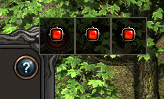

# Tips 文本

Tips 窗口中的格式设置是使用的 `JSON` 格式的字符串进行说明的，称其为 Tips 文本。

Tips文本是一个JSON字符串。每个Tips是JSON值的数组，数组用中括号(`[]`)括起来。每个JSON值可以是数组、表、字符串和数字。

示例：

``` JSON
[
    {
        "type":"img",
        "imgid":1896690000
    }
]
```

程序根据每个类型，即 `type` 进行分析，各个类型的定义如下节描述。

Tips 文本在被显示到 Tips 中时，显示顺序是从左往右从上到下。

# 类型 （type）定义

## `page` 分页

此类型可将Tips设置为分页格式。

将此类型放到需要分页的 `JSON` 对象中间如：

``` lua
[
  {
    "type": "img",
    "imgid": 1900100001
  },
  {
    "type": "page"
  },
  {
    "type": "img",
    "imgid": 1900100001
  },
  {
    "type": "page"
  },
  {
    "type": "img",
    "imgid": 1900100001
  }
]
```

效果图：



如图 Tips 分了三页。


需要注意的是
1. 可以使用[all类型](https://image-storage.oss-cn-hangzhou.aliyuncs.com/tool-platform/prod-2d/apidocsource/client_api_source/%E5%B1%9E%E6%80%A7%E3%80%81%E4%BA%8B%E4%BB%B6%E5%92%8C%E5%AE%9A%E4%B9%89/10_guide_tips_json_v1.0.html?v=1719395136030#id3)（单页设置）中的**width**和**height**属性来设置单页Tips的宽度和高度，单位为像素（px）；
2. 可配合使用全局变量`TipCmpSameHeight`，用于控制当有多个Tips高度时是否使用最高的Tip高度；
3. 可配合使用全局变量`TipPageMarginX`，用于设置分页Tips之间的水平间距，单位为像素（px）。


## all（全局设置）

全局设置指设置Tips的高度和宽度，此项为非必须设定值。
 
| **字段名称** | **字段描述**                           |
| ------------ | -------------------------------------- |
| width        | 指定Tips的最小宽度，单位为像素（px）。 |
| height       | 指定Tips的最小高度，单位为像素（px）。 |

## set （绘制坐标）

此类型为设置当前绘制的坐标。

| **字段名称** | **字段描述**                         |
| ------------ | ------------------------------------ |
| offx         | 指定当前坐标的水平偏移，为相对位置。 |
| offy         | 指定当前坐标的垂直偏移，为相对位置。 |
| posx         | 指定当前绘制的水平坐标，为绝对位置。 |
| posy         | 指定当前绘制的垂直坐标，为绝对位置。 |

## img（图片和特效）

此类型为Tips添加图片或特效。

| **字段名称** | **字段描述**                                                                                                                  |
| ------------ | ----------------------------------------------------------------------------------------------------------------------------- |
| imgid        | 指定图片资源ID。                                                                                                              |
| color        | 指定图片颜色，默认为白色。                                                                                                    |
| gray         | 指定是否灰度绘制，默认为false。true表示图片以黑白色显示。                                                                     |
| width        | 指定图片的宽度。如使用此字段，图片将根据指定的宽度进行缩放，注意必须与height字段配套使用。                                    |
| height       | 指定图片的高度。如使用此字段，图片将根据指定的高度进行缩放，注意必须与width字段配套使用。                                     |
| animate      | 指定是否是动画，默认为false。如果是动画，需要将图片资源ID添加到**序列帧**的表中。                                             |
| rect         | 指定是否使用裁剪区域（true代表是，即使用设置的宽度和高度裁剪图片；false代表否，即使用设置的宽度和高度进行缩放显示，为默认值） |
| flip         | 指定镜像翻转的方式（0不翻转，1左右翻转，2上下翻转，3上下左右翻转）                                                            |
| angle        | 指定Tips框中的图片的旋转角度（类型为int，正数代表顺时针旋转，负数代表逆时针旋转）                                             |

> 备注：
>  图片资源 ID 添加到序列帧的表中是指的：**动画资源播放速度配置**
> 动画资源播放速度在配置文件**AnimSetting.xml**中定义。

## text （文字）

此类型为Tips添加文字。
 
| **字段名称** | **字段描述**                                                                                    |
| ------------ | ----------------------------------------------------------------------------------------------- |
| info         | 指定要添加的文本。                                                                              |
| color        | 指定文本颜色。首次执行默认是白色，其它情况则默认为上一次绘制文本的颜色。                        |
| font         | 指定文本的字体。首次执行默认system，其它情况则默认为上一次绘制的文本的字体。                    |
| autoline     | 指定是否自动换行。默认为false。如果自动换行，当文本宽度超过Tips的宽度，则自动切到下一行。       |
| left         | 仅在autoline字段为true时有效。自动换行时指定下一行横坐标的起始位置。                            |
| width        | 仅在autoline字段为true时有效。指定每行文字的宽度，使文字的右边界自动对齐。                      |
| align        | 当文字的左边是图片元素时，指定此文字的垂直对齐方式。0为顶端对齐；1为居中对齐；2为底端对齐方式。 |