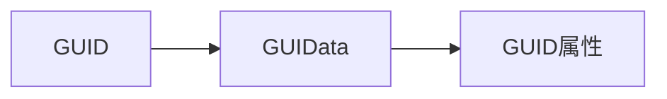

# 引擎物品系统

物品在游戏中的运用十分广泛，我们通常是需要把握物品的几个常用属性，物品的其他概念，以及物品与游戏其他的组成部分发生的联系以及起的作用。

我们认识物品首先是认识物品模板表，即：Item模板属性，详情看 **Item 模板属性定义**

我们要在游戏中添加物品就可以在这个表中添加表项。系统上有说明。
熟悉了此表中的属性我们就可以在写代码的时候用得上。

这些属性，有一些常用的和不常用的，常用的是指可以当做查找不常用属性主键。

关于物品操作的 api 分为服务端跟客户端。这两端的权限不一样。

## 物品服务端 API

服务端对于物品的操作是最高的，可以删除玩家物品。穿脱装备，销毁物品等详细设置物品的属性值的 api

对于服务端的 api 操作大部分是对物品的操作上。

其中如果设计服务端和客户端两端传递物品 GUID 的话是需要利用特定的 API 进行两端互转的。因为两端物品的 GUID 是不一样的。这两个 api 都在客户端，因此 GUID 的转换操作都在客户端进行。：

``` lua
UI:Lua_GUID2Str(_Str) -- 客户端GUID转服务端GUID
UI:Lua_Str2GUID(_Str) -- 服务端GUID转客户端GUID
```


## 物品客户端 API

在客户端中我们的权限没有服务端那么大，大部分是获取物品属性和设置物品框的操作。

在实际的开发中，我们会遇到几种关于物品的概念：
- GUID
- GUIData 句柄
- 物品索引名
- 模板属性
- 实体属性
- 物品 ID（实际上就是模板 ID）
- 实体句柄

客户端的 API 大体可以分为两类：获取和设置。

获取操作，是拿可以起索引值作用的值来获取物品属性（包括物品模板）或物品 GUIData 属性的操作。
常用的起索引值作用的值：
- GUID
- GUIData 句柄
- 物品 ID
- 物品模板句柄

设置成操作，是可以设置物品 GUIData 属性，是的，在客户端没有设置物品属性的操作，只有获取，而设置操作大多是设置物品 GUIData 属性。而设置 GUIData 属性的操作大多时候与物品框相关联。

下面是一些概念与 api 的说明，可以通过阅读下面的 api 来加深上述的印象。通过什么获取什么，通过什么操作什么。而这些操作有一些是附加了物品属性类型的参数，这个参数可以参考物品属性表。

### 物品属性

物品属性分为**物品模板属性**和**物品实体属性**

获取物品属性的 api 有两个：

- 根据物品 GUID 获取： `CL:GetItemEntityPropByGUID(_ItemGUID_Uint64Str,_PropType)`
- 根据物品 ID 获取 `CL:GetItemEntityPropByHandle(_ItemEntityHandleID,_PropType)`


物品 GUID 就是标记了一个物品实体的标识符。类似与指针的概念。

无论是获取物品模板属性还是物品实体属性，都要认识到这两种属性是两张表而已。

物品模板属性类似于类，而物品实体属性类似对象

根据 api 获取物品的属性，都是在查表，就是离不开关键字了即：`_PropType`（物品的属性类型）

#### 物品模板属性

物品模板属性在脚本文件**DB_ItemDefine. Lua**中定义。

在游戏实际运行时，物品模板也会有句柄。我们可以通过模板句柄来获取物品的模板属性。

获取**物品模板信息属性**的 api 有两个：

- 根据物品的**模板句柄**：`CL:GetItemTemplatePropByHandle(_ItemTemplateHandle,_PropType)`
- 根据**物品 ID** 获取：`CL:GetItemTemplatePropByID(_ID,_PropType)`

获取**模板句柄**：

- 根据索引名获取物品的模板句柄：`CL:GetItemTemplateHandleByKeyName(_KeyName)`
- 根据 GUID 获取物品的模板句柄：`CL:GetItemTemplateHandleByGUID(_ItemGUID_Uint64Str)`
- 根据物品 ID 获取物品的模板句柄：`CL: GetItemTemplateHandleByID (_ID)`

#### 物品实体属性

物品实体属性在脚本文件**ItemEntityDefine. Lua**中定义。

其中手游与端游的属性索引会有差别

实体属性通常用获取物品属性的两个 api 获取。

### 物品自定义变量

物品自定义变量有两种：
- 整型 (`int`)
- 字符串 (`string`)

物品自定义变量在客户端只能通过物品实体句柄获取，但是可以通过其他属性获取到物品实体句柄，再通过实体句柄获取到物品自定义变量

### 物品位置
物品位置在脚本文件**SiteDefine. Lua**中定义。

根据物品位置获取物品属性的 api 有两个：

- 获取物品 `GUID`：`CL:GetPlayerSelfEquipGUID(_PartType)`
- 获取物品 `GUIData` 句柄：`CL:GetEquimentItemDataPart(_PartType)`

以上是获取玩家自身的

- 获取选中玩家指定装备位装备的 GUIData 句柄：`CL:GetOtherEquimentItemDataPart(_PartType)`
- 获取目标玩家所有装备的 GUIData 句柄：`CL:GetPlayerTargetEquipData()`

以上是查看别的玩家的 api

### 物品 GUID

物品 GUID 是标识一个物品实体的标识符，相当于一个指向内存地址的指针。

### GUIData 属性

GUIData 属性类型在脚本文件**SiteDefine. Lua**中定义。

GUIData 属性通常是物品与**物品框产生联系**时产生的。GUIData 也是有句柄的。

---

有关 API：分为设置和获取两个方面

**获取** GUIData 句柄或者 GUIData 属性：

- 获取物品框中物品的 GUIData 句柄：`GUI:ItemCtrlGetGUIData(_HandleID)`
- 获取物品框中物品的属性值：`GUI:ItemCtrlGetGUIDataPropByType(_HandleID,_PropType)`，这个 api 获取 GUIData 属性（仅限端游使用，手游不可用）
- 获取物品框中物品的属性值：`RDItemCtrlGetGUIDataPropByType(_Handle,_Info,_PropType)` (端游、手游都可用)

**设置** GUIData 或者是设置 GUIData 属性，或者根据 GUIData 设置其他

- 根据 GUIData 属性类型设置物品 GUIData 属性值：`CL:SetItemGUIDataPropByType(_ItemGUIDataHandleID,_PropType)`
- 设置物品框中物品的属性值：`GUI:ItemCtrlSetGUIDataPropByType(_HandleID,_PropType)`，这个 api 设置的实际上是与 GUIData 属性
- 设置物品框中物品的属性值：`RDItemCtrlSetGUIDataPropByType(_Handle,_Info,_PropType,_PropValue)`
- 设置鼠标上的物品：`CL:SetMouseGUIItemData(_ItemGUIDataHandle)`

通常我们可以使用物品的 GUIData 句柄作为物品中转的一个桥梁。

**设置物品框中 ICON：**
需要注意的是，当使用：`SetItemGUIDataPropByType`（根据 GUIData 属性类型设置物品 GUIData 属性值）这个 api 填充 `ICON` 时，必须要分辨要填充的类型（默认是物品），如果要依靠这个 api 将技能图标设置上时，需要实现通过 `ITEMGUIDATA_TYPE` 来设置物品框的类型，即表 1 中的 `ITEMGUIDATA_TYPE` 项。
当通过这个方式（模板 ID 填充 ）设置物品框图片时，不需要再额外地通过模板 ID 获取图标再设置物品框 `ICON` 了。

示例：
``` lua
LuaArg = ImgID
CL:SetItemGUIDataPropByType(GUIDataHandle, ITEMGUIDATA_ITEMID)
LuaArg = 2 --[[@as number]] --设置物品框类型为技能
CL:SetItemGUIDataPropByType(GUIDataHandle, ITEMGUIDATA_TYPE)
GUI:ItemCtrlSetGUIData(_Handle, GUIDataHandle)
```


---
表 1: 物品框 GUIData 属性

| **索引** | **名称**                    | **数据类型**           | **描述**               |
| ------ | ------------------------- | ------------------ | -------------------- |
| 0      | ITEMGUIDATA_ITEMGUID      | string             | GUID                 |
| 1      | ITEMGUIDATA_IMAGEID       | unsigned int       | ICON                 |
| 2      | ITEMGUIDATA_TYPE          | unsigned int       | 类型：`1` 代表物品；`2` 代表技能 |
| 3      | ITEMGUIDATA_ITEMID        | unsigned int       | 模板ID                 |
| 4      | ITEMGUIDATA_PARAM         | unsigned int       | 自定义参数                |
| 5      | ITEMGUIDATA_ITEMCOUNT     | unsigned int       | 数量                   |
| 6      | ITEMGUIDATA_INVALIDATE    | bool               | 是否有效                 |
| 7      | ITEMGUIDATA_ISSTACKITEM   | bool               | 是否可堆叠                |
| 8      | ITEMGUIDATA_ITEMPOS       | int                | 绝对位置                 |
| 9      | ITEMGUIDATA_CDTIME        | unsigned int       | CD时间                 |
| 10     | ITEMGUIDATA_CDSTARTTICK   | unsigned int       | CD开始时间               |
| 11     | ITEMGUIDATA_INCDSTATE     | bool               | 是否CD状态               |
| 12     | ITEMGUIDATA_ITEMLOCK      | bool               | 是否锁定                 |
| 13     | ITEMGUIDATA_ITEMPRICETYPE | int                | 价格类型：1代表金币；2代表元宝     |
| 14     | ITEMGUIDATA_ITEMPRICE     | unsigned long long | 价格                   |
| 15     | ITEMGUIDATA_ISSHOWBIND    | bool               | 是否绑定                 |


### 总结



# 物品框

GUIData 在大多数情况下是阐述物品框与一个实际的物品发生关联式的数据。


## 物品框的图片

**图片种类：**
1. 背景图片
2. 物品图片
3. 默认图片
4. 特效图片
5. 前景图片
6. 高亮图片
7. 未生效的锁图片
8. 绑定物品的锁图片
9. 物品比较箭头
10. 大图片（顶部图片）
11. 品质背景框

**ItemCtrlSetInvalidLockData**：

- 游戏中，物品框在未生效的状态下，会显示锁定。
- 可使用 `ItemCtrlSetInvalidLockData` 接口设置锁图标的资源和偏移。此函数设置物品框未生效状态的锁图标


**默认图片**是在设置图片失败时显示的图片

- 通过 `ItemCtrlSetDefaultImage` 进行**设置**
- 通过 `ItemCtrlGetDefaultImage` 进行**获取**


**背景图片**：在使用 api 创建物品框时，所指定的图片 id 就是物品框背景图片

- 在物品图片下方或者空白物品栏显示的图片
- 背景图片可以通过下列两个 api 来进行**设置**
	- `GUI:ItemCtrlSetBackImageID(_HandleID,_ImgId)` 
	- `RDItemCtrlSetBackImageID(_Handle,_Info,_ImgId)`
- 可以通过 `GUI:ItemCtrlSetBackImageIsAdapt(_HandleID,_IsAdapt)` 来设置背景图片是否自适应显示，即是否根据物品框控件的大小**自适应显示**
- 可通过 `ItemCtrlGetBackImageID` 进行**获取**，物品框背景图片 ID 通过函数返回

**物品图片**：在背景图片的上面，可用**设置物品框的属性值**的两个 api 进行设置，也可以用 **[[客户端/物品系统与物品框#物品填充物品框（或显示物品图片）|物品填充物品框（或显示物品图片）]]** ，这样就会默认显示物品图片。

- 物品图片可以通过 `ItemCtrlSetColor` 来设置**物品的颜色**，这个设置也可以对大图标生效
- 物品**图片的大小**可用 `ItemCtrlSetIconSize` 设置，物品大小可以超出物品框大小。（对物品图片大图标不适用）
- 物品图标也可设置**是否为大图标**，大图标的模型在**游戏配置**->**道具模板表**中
- 可以通过 `ItemCtrlGetColor` 获取物品框中道具的颜色，通过函数返回
- 通过 `ItemCtrlGetIconSize` 获取物品框中物品的图标尺寸大小，结果储存在 `LuaRet` 中
	- `LuaRet[1]` 图片的宽度；
	- `LuaRet[2]` 图片的高度。

**物品图片大图标**：相比普通物品框，大图标类型的物品框尺寸大小并不局限在固定的大小方格内。

- 大图标的**位置**也可以用 `ItemCtrlSetBigIconOffset` 来设置偏移量
- 大图标也可以通过 `ItemCtrlSetBigIconAnim` 来设置**是否显示动画**
- 通过 `ItemCtrlGetBigIconOffset` 取物品框中物品大图标的偏移，函数返回 `bool`，具体地偏移量储存在 `LuaRet` 中：
	- `LuaRet[1]` 图片的水平偏移量；
	- `LuaRet[2]` 图片的垂直偏移量。
> 大图标物品一般用于显示角色模型中各部位显示。

**物品框特效图片**：特效图片显示在物品图片上方

- 通过 `ItemCtrlSetEffectImageID` 进行设置，图片及其缩放比例

**前景图片：** 物品框前景图片是显示在物品图片的上方，还显示在特效图片上方

- 通过 `RDItemCtrlSetFrontImageID` 或 `ItemCtrlSetFrontImageID` 进行设置
- 在端游中，前景图片默认会以做物品框左上角为原点创建，默认偏移量为 `(x:-16,y:-16)`
- 可用 `ItemCtrlSetFrontImageOffset` 设置偏移量
- 通过 `ItemCtrlGetFrontImageID` 进行获取
- 用法例子：![[4798cb5a4e09fa0af1a549287fb7c966.png]]

**物品框高亮图片**：在物品框前景图片上面，指的是鼠标移动到物品栏上方时，显示的图片，起到标志的作用。

设置物品框高亮图片的 api 有三个：
- `UI:Lua_RDItemCtrlSetHighlightImageID(_ImgId)`
- `GUI:ItemCtrlSetHighlightImageID(_HandleID,_ImgId)` 
- `RDItemCtrlSetHighlightImageID(_Handle,_Info,_ImgId)` 

如果想要不显示高亮图片，可以让设置图片 `id` (`_ImgId`) 为 `0`:
``` lua
GUI:ItemCtrlSetHighlightImageID(_Handle, 0)
```

**物品框锁图片**：在物品框高亮图片上面，想要显示锁图片，

- 首先要通过 `ItemCtrlSetLockImage` 设置图标，需要注意设置后图标显示对所有物品框生效。
- 然后再通过 `ItemCtrlSetShowLockImage` 设置单个物品框的锁图标是否显示

**物品框的品质比较箭头**：用法与锁图标一样

- 通过 `ItemCtrlSetQualityImage` 设置箭头
- 再通过 `ItemCtrlSetShowQualityArrow` 显不显示箭头

示例代码：


``` lua
 local _Handle = GUI:ItemCtrlCreate(_Parent, "testitem", 1850400004, 0, 0, 60, 60)
if _Handle ~= 0 then
	RDItemCtrlSetGUIDataEnable(_Handle, nil, true)
	-- RDItemCtrlSetGUIDataPropByType(_GUIHandle, nil, ITEMGUIDATA_INVALIDATE, true)
	-- GUI:ItemCtrlSetBackImageID(_Handle,1850400004)  --设置物品框的背景图片
	GUI:ItemCtrlSetBackImageIsAdapt(_Handle, true)
	GUI:ItemCtrlSetDefaultImage(_Handle, 1900010042)
	-- 设置物品框中的物品图片
	-- LuaArg = 1891410039
	-- GUI:ItemCtrlSetGUIDataPropByType(_Handle,ITEMGUIDATA_IMAGEID)
	-- GUI:ItemCtrlSetIconSize(_Handle,100,100)
	-- 特效图片
	GUI:ItemCtrlSetEffectImageID(_Handle, 3021800000, 0.5)
	--设置物品框的前景图片
	GUI:ItemCtrlSetFrontImageID(_Handle, 1800000065)
	-- GUI:ItemCtrlSetFrontImageOffset(_Handle, 0,0) --设置物品框前景图片偏移量为0
	RDItemCtrlSetGUIDataPropByKeyName(_Handle, nil, "青铜剑", 1, true) --根据物品的索引名称填充物品框
	GUI:ItemCtrlSetColor(_Handle, COLOR_RED)
	-- RDItemCtrlSetGUIDataPropByKeyName(_Handle,nil,"怒攻神丹",1,false)  --根据物品的索引名称填充物品框
	-- RDItemCtrlSetBigIcon(_Handle,nil,true)  --设置物品框中的物品显示为大图标
	-- GUI:ItemCtrlSetIconImageType(_Handle,1)
	-- if GUI:ItemCtrlGetIconImageType(_Handle) ~=0 then
	--     CL:ShowTypeMsg(3,"物品是大图标")
	--     -- GUI:ItemCtrlSetBigIconAnim(_Handle,true,150)
	-- end
	GUI:ItemCtrlSetShowLockImage(_Handle, true)
	GUI:ItemCtrlSetLockImage(1853790037, -5, 5, 10000, 10000)
	GUI:ItemCtrlSetMouseEnableSelect(_Handle, true)
	GUI:ItemCtrlSetShowQualityArrow(_Handle, true)
	GUI:ItemCtrlIsShowItemCount(_Handle)
	if GUI:ItemCtrlGetRBtnUse(_Handle) == true then
		CL:ShowTypeMsg(3, "可以使用右键")
	else
		CL:ShowTypeMsg(3, "不以使用右键")
	end
end
```

## 物品框信息格式

**物品框物品信息**可以由JSON字符串来填充。物品信息的JSON字符串格式是一个表，表用大括号({})括起来。

物品框物品信息可以通过客户端 api：`GUI:ItemCtrlSetJson(_HandleID,_JsonString)` 和 `RDItemCtrlSetJson(_Handle,_Info,_JsonString)` 来对物品框进行设置。

并且在服务端，还可以通过 
1.  `lualib:Json2ItemEx2(strPlayer,strJson,bNew,desc)`
2. `lualib:Json2ItemEx(strPlayer,strJson,bNew)` 
3. `lualib:Json2ItemWithSiteType(strPlayer,strJson,bNew,desc,site_type)` 
4. `lualib:Json2Item(strPlayer,strJson)` 
这 4 个 api 来生成物品实体。

每个JSON值可以是数组、表、字符串和数字。

**类型定义**:

|**字段名称**|**数据类型**|**字段描述**|
|---|---|---|
|g|String|物品的GUID|
|i|Integral|物品的模板ID|
|n|String|物品的名称|
|s|Integral|当前物品在物品框中的位置|
|a|Integral|当前物品的堆叠数量|
|d|Integral|物品当前耐久值|
|dm|Integral|物品最大耐久值|
|uc|Integral|物品剩余使用次数|
|b|Integral|物品是否绑定|
|lf|Integral|物品剩余的存在时间|
|eq|Object|[装备拓展数据](https://image-storage.oss-cn-hangzhou.aliyuncs.com/tool-platform/prod-2d/apidocsource/client_api_source/%E5%B1%9E%E6%80%A7%E3%80%81%E4%BA%8B%E4%BB%B6%E5%92%8C%E5%AE%9A%E4%B9%89/14_guide_item_json_v1.0.html?v=1719395136030#extra_equipment_data)|
|cus|Object|[物品自定义变量](https://image-storage.oss-cn-hangzhou.aliyuncs.com/tool-platform/prod-2d/apidocsource/client_api_source/%E5%B1%9E%E6%80%A7%E3%80%81%E4%BA%8B%E4%BB%B6%E5%92%8C%E5%AE%9A%E4%B9%89/14_guide_item_json_v1.0.html?v=1719395136030#item_custom_variable)|

**装备拓展数据**：对应着**类型定义**里的 `eq` 字段，这里的 `eq` 字段是一个对象，也就是一个表

| **字段名称** | **数据类型**               | **字段描述**                                                      |
| -------- | ---------------------- | ------------------------------------------------------------- |
| v        | Integral               | 装备版本                                                          |
| q        | Array[Array[Integral]] | 装备品质属性（共6个，数组格式为：`[索引位置1,属性索引号1,属性值1],[索引位置2,属性索引号2,属性值2]）    |
| idt      | Array[Array[Integral]] | 装备鉴定属性（共3个，数组格式为：`[索引位置1,属性索引号1,属性值1],[索引位置索引号,属性索引号2,属性值2]`） |
| r        | Array[Array[Integral]] | 装备精炼属性（数组格式为：`[精炼等级,精炼属性索引号,精炼属性值]`）                          |
| lc       | Integral               | 装备幸运/诅咒（正数表示幸运，负数表示诅咒）                                        |
| ext      | Array[Array[Integral]] | 装备扩展属性（共10个，数组格式为：`[索引位置1,属性索引号1,属性值1],[索引位置2,属性索引号2,属性值2]`）  |

>备注
>索引位置从0开始，依次类推。
>属性索引号与玩家角色的32位属性中各属性索引号相对应。

**物品自定义变量**：对应着**类型定义**里的 `cus` 字段，这里的 `eq` 字段是一个对象，也就是一个表
 
| **字段名称** | **数据类型** | **字段描述**                                 |
| -------- | -------- | ---------------------------------------- |
| i        | Object   | 物品int类型自定义变量（例如：`"i":{"type":1}`）        |
| s        | Object   | 物品string类型自定义变量（例如：`"s":{"name":"abc"}`） |
该表在对物品设定了相关的自定义变量之后，该表中才有值，设定之后，也是是键值对的方式。

我们可以通过将 json 字符串转为 Lua 对象的方式，来对操作物品的 json 信息，从而可以借用 api 来生成我们想要的物品实体。

--TODO


## 设置物品框是否可使用右键

物品框使用右键代表着右键使用物品

1. `RDItemCtrlSetRBtnUse`
2. `ItemCtrlSetRBtnUse`

## 将物品框设为有效状态的几种方法

1. `RDItemCtrlSetGUIDataEnable(_Handle, _Info, _Enable)` 设置物品框是否有效
2. `RDItemCtrlSetGUIDataPropByType(_Handle,_Info,_PropType,_PropValue)` 设置物品框属性值
3. `GUI:ItemCtrlSetGUIDataPropByType(_HandleID,_PropType)` 设置物品框的属性值
4. `RDItemCtrlSetProp` 一键设置物品框属性

如果，看到**技能的图标**上边也有一个锁图标的话，也可以使用这个方法。


## 物品填充物品框（或显示物品图片）

要显示物品之前首先要使物品框有效。

有几种方法：

1. 根据物品 GUID 填充物品框：`RDItemCtrlSetGUIDataPropByGUID`
2. 根据物品 GUIDdata 句柄填充物品框：`RDItemCtrlFillGUIData`
3. 根据物品模板 ID 填充物品框 `RDItemCtrlSetGUIDataPropByItemID`
	- 此 API 也可以用来填充技能，不过技能图标会变成映射之后的形状（圆形） 
	- 用于填充技能时，同样需要设置物品框类型为技能（GUIData 属性：`ITEMGUIDATA_TYPE`）
4. 根据 `JSON` 字符串填充物品框物品：`GUI:ItemCtrlSetJson(_HandleID,_JsonString)`
5. 根据 `JSON` 字符串填充物品框物品 `RDItemCtrlSetJson`
6. 根据索引名填充物品框数据 `RDItemCtrlSetGUIDataByKeyName`（手游）
7. 根据索引名填充物品框 `RDItemCtrlSetGUIDataPropByKeyName`（端游）
8. 根据索引名填充物品框数据 `GUI:ItemCtrlSetGUIDataByKeyName(_Handle,_Info,_KeyName,_Count,_IsBind)`（H 5）
9. 设置物品框中物品的 GUIData 句柄：`GUI:ItemCtrlSetGUIData(_HandleID,_ItemDataHandle)`


以上操作也是在物品框上**显示物品图片**的几种操作。

除此之外，物品框也可以通过 GUIData 句柄来设置物品显示的物品的图片。（设置物品框属性）
> 注：物品框属性即为 GUIData 属性

若是通过 `CL:SetItemGUIDataPropByType` API 设置 GUIData 的 `ITEMGUIDATA_IMAGEID`（`ICON`），或者
`ITEMGUIDATA_ITEMID`（`模板ID`）属性，通常设置了模板 ID 就不需要再设置 `ICON` 了。不过通常在手游上，技能的图标是经过了映射的，所以需要将技能图标改为手游映射后的技能图标。

通过物品框句柄获取的 GUIData 句柄更改 `ITEMGUIDATA_IMAGEID` 属性值，一定要用 `GUI:ItemCtrlSetGUIData`, 将 GUIData 句柄设置回物品框，不然可能会出现物品图标不正常的情况。

在通过**索引名**和**物品模板 ID**填充物品框之后，有可能会出现物品图标发虚的现象：![[附件/Pasted image 20240828185431.png]]，正常：![[附件/Pasted image 20240828185611.png]]
原因是在使用填充 api 时，将物品堆叠数量填为了 `0` ，改成 `1` 就正常了。


## 根据精炼等级显示精炼特效

可以根据 api 设置成物品精炼等级

``` lua
RDItemCtrlUpdateRefineAnimate(_Handle,_Info)
```

## 设置物品框属性

``` lua
---设置物品框中物品的属性值
---@param _HandleID int @ 窗口句柄
---@param _PropType int @ GUIData属性类型
---@return bool @设置结果
GUI:ItemCtrlSetGUIDataPropByType(_HandleID,_PropType)
---设置物品框中物品的属性值
---@param _HandleID int @ 窗口句柄
---@param _Info string
---@param _PropType int @ GUIData属性类型
---@return bool @设置结果
RDItemCtrlSetGUIDataPropByType(_Handle,_Info,_PropType,_PropValue)
```

>  注意：对应属性类型的参数需要通过全局变量 `LuaArg` 来传递。

## 物品框放置物品 （物品移动）

官方示例：

``` lua
local _GUIHandle = GUI:ItemCtrlCreate(_Parent, "宝石"..k, 0, v[1], v[2], 40, 40)--创建物品框
if _GUIHandle ~= 0 then
    RDItemCtrlSetGUIDataEnable(_GUIHandle, "", true)
    GUI:WndRegistScript(_GUIHandle, RDWndBaseCL_mouse_rbClick, "Gem.RClear") --注册右键清除物品框函数
    Sys_PushBackItemWindow(_GUIHandle, "Gem.OnGemIn")--注册物品移入函数
end
```

第一步：先将物品框设置为有效的。

``` lua
RDItemCtrlSetGUIDataEnable(_GUIHandle, "", true)
```

第二步：注册逻辑事件。下面的函数代表着对物品框注册**物品移入物品框事件**，`_GUIHandle` 为物品框句柄，该 api 是专门为了物品框移入物品而产生的。不过该 api 较老，也可以用 `RegisterUIEvent` 实现，该函数也是用 ` RegisterUIEvent`  实现的

``` lua
Sys_PushBackItemWindow(_GUIHandle, "Gem.OnGemIn")
```

然后定义事件回调函数：事件回调函数的返回值很关键，函数返回 `true` 代表可以移入物品，而返回 `false` 代表着不可以移入物品。该函数是物品放入物品框的回调函数。
其函数签名为：
``` lua
---判断物品是否能放入物品框
---@param this int @物品框句柄
---@param GUIData int @物品框GUIData句柄
---@param DragIn boolean @`true`代表鼠标拖动放进来，`false`代表鼠标在背包右键点击进入
---@param GUID string @物品GUID
---@param ItemId int @物品模板ID
---@param KeyName string @物品索引名
---@param ItemPos int @物品的绝对位置
---@param IsBound bool @物品是否绑定
---@param Count int @物品数量
---@return boolean @如果物品框允许进入物品框返回`true`，否则返回`false`
function FuncName(this, GUIData, DragIn, GUID, ItemId, KeyName, ItemPos, IsBound, Count)
end
```

回调函数示例：

``` lua
function Gem.OnGemIn(this, GUIData, DragIn, GUID, ItemId, KeyName, ItemPos, IsBound, Count)--放入宝石
    --判断移入物品的主类型
    if CL:GetItemEntityPropByGUID(GUID, ITEM_PROP_TYPE) then
        ItemType = LuaRet; 
    end
    --判断移入物品的子类型
    if CL:GetItemEntityPropByGUID(GUID, ITEM_PROP_SUBTYPE) then
        ItemSubType = LuaRet; 
    end
    if ItemType == 1 and ItemSubType == 11 then
        --判断物品框中是否有物品
        if RDItemCtrlGetGUIDataKeyName(this, nil) == "" then 
        --物品移入函数return true就可以放入物品，
        --return false就不能放入，具体逻辑可以自己写
            return true 
        end
    else
    -- 不可以放入物品的情况
        MessageBox(0, "放入的物品不是宝石！")
        return false
    end
end
```

主要的逻辑是依据物品的类型判断是否可以移入物品框：

主要使用的 api：

``` lua
-- 根据GUID获取物品值
---@param _ItemGUID_Uint64Str @string @物品的GUID
---@param _PropType int @ 物品的属性类型（实体属性或模板属性）
---@return bool @结果存放到LuaRet中
CL:GetItemEntityPropByGUID(_ItemGUID_Uint64Str,_PropType)
```

然后再判断物品框中是否已经存在物品，如果有，则返回 `false`，没有则返回 `true`

注册完毕后，同时打开背包和窗口，右键点击响应物品，就会看到物品被移入物品框中，而背包中的物品会出现**锁定**字样

如果想要对物品框点击鼠标右键将物品返回背包则对物品框注册**鼠标右键点击事件**：

``` lua
function Gem.RClear(this)--右键移出物品
    if RDItemCtrlGetGUIDataKeyName(this, nil) ~= "" then
        GUI:ItemCtrlClearItemData(this)
    end
end
```

直接使用**清空物品框数据**api，因为物品并不在物品框中，实际在被移动之前的地方，比如背包中，物品框只是根据物品的 GUIData 句柄，设置了物品框本身的 GUIData 数据，然后显示成对应的样式而已。

清楚物品框数据 api


> 1. 需要注意的是，只能通过，这样的操作来移动物品。别的方式在神途引擎中没有实现。比如想要实现穿戴物品的操作，就要借助服务端相应的 api 来真正地移动物品
> 2. 人物装备栏中的装备栏物品框是引擎自动实现的，而且只能在人物界面中显示这些物品框，汽车他的界面是不行的。


## 在别的人物界面中显示人物装备框

以人物装备界面为父窗口创建窗口，并控制其他物品框和窗体控件的可见性来达到目的。

具体方案：通过 `UI:Lua_OpenWindow` 以人物装备界面为父窗口打开然后在切换窗口时，通过 `GUI:WndSetVisible` 来控制窗口的可见性。在人物界面时。五个坐骑装备栏不可见，在其他界面时，五个坐骑装备栏显示。

## 物品框杂项

### 物品框物品数量
设置物品框是否显示物品数量
``` lua
GUI:ItemCtrlSetShowItemCount(_HandleID,_Flag)
```
